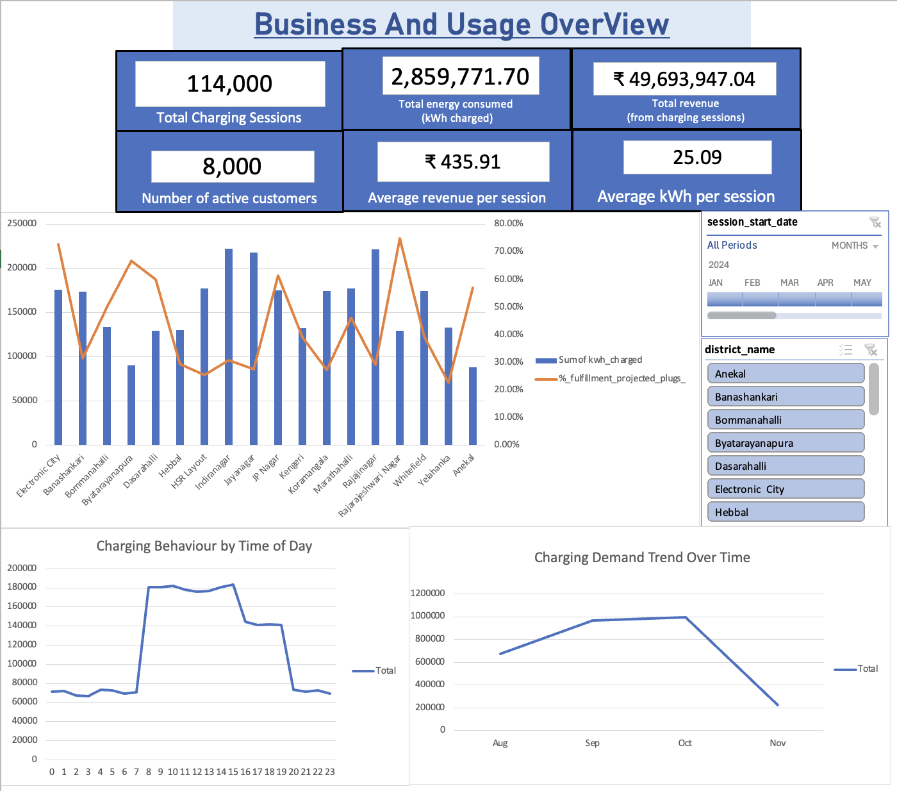
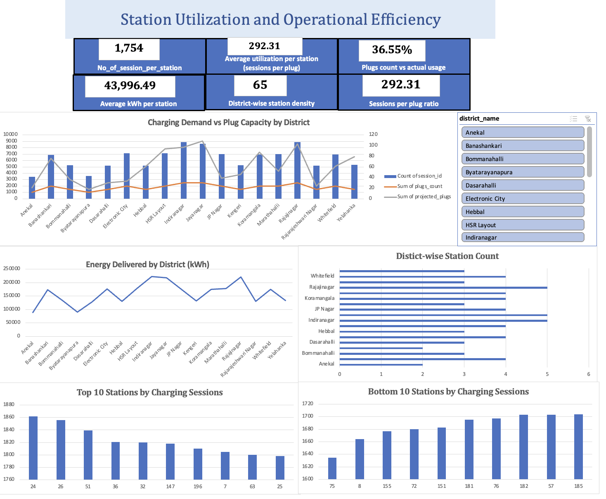
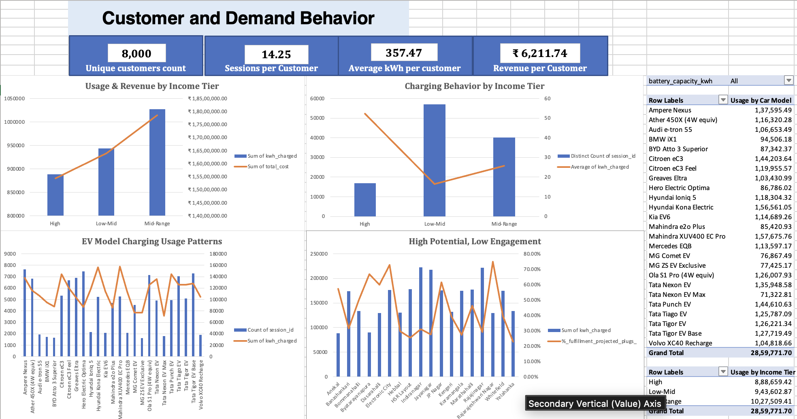
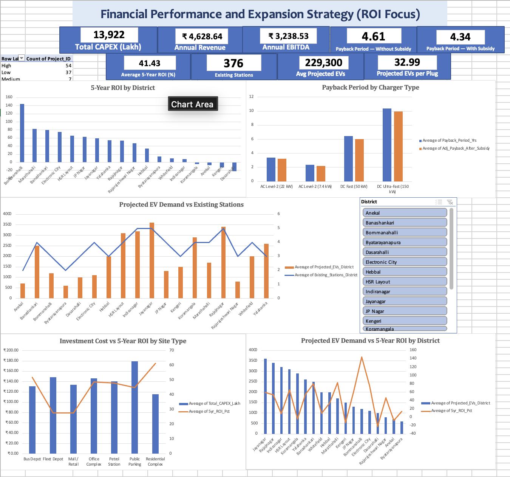

# Tata Power EV Charging Analysis
### Excel Dashboard | Energy Demand | Station Performance | Investment Planning

An analysis of EV charging activity across 18 Bengaluru areas to understand demand, compare station performance, and assess future charging capacity.

**By Vibha Pateshwari**

[View Excel Workbook](dashboards/) · [Dashboard Screenshots](images/) · [Explore Data](data/)

---

## Project at a Glance

| Charging Sessions | Energy Delivered | Charging Revenue |
|:---:|:---:|:---:|
| **114,000** | **2.86 million kWh** | **₹4.97 crore** |

| Active Customers | Existing Stations | Existing Plugs |
|:---:|:---:|:---:|
| **8,000** | **65** | **390** |

**Analysis period:** 11 August – 8 November 2024  
**Project type:** Educational case study using supplied datasets.

## Business Questions

- How does charging demand change over time and throughout the day?
- Which stations and districts record the highest activity?
- How do income tiers and EV models influence charging behavior?
- Where does projected demand exceed existing plug capacity?
- Which proposed investments offer stronger ROI and shorter payback?

## Tools and Skills

**Excel · Power Query · Power Pivot · Data Modeling · PivotTables · PivotCharts · Slicers**

- Combined five related tables into an Excel Data Model.
- Created KPI summaries for energy, revenue, customers, and capacity.
- Compared performance across stations, districts, and customer groups.
- Evaluated proposed investments using supplied financial projections.

---

## Key Findings

### Charging Demand

- **32.1K kWh/day:** Average daily demand was similar in September and October.
- **222.5K kWh:** Indiranagar recorded the highest district energy delivery.
- **Partial months:** August and November do not contain complete months of data.

**Business takeaway:** Compare daily averages before interpreting changes in monthly totals.

### Infrastructure Capacity

- **390 plugs** currently installed against **1,067 projected required plugs**.
- **677 additional plugs** needed to meet the supplied capacity projection.
- **Jayanagar:** Largest individual projected shortfall, at **79 plugs**.

**Business takeaway:** Review districts with large capacity gaps for future expansion. A projected gap does not prove current congestion.

### Customer Behavior

- **Low-Mid income tier:** Around **50% of charging sessions**.
- **Mid-Range income tier:** Largest revenue contribution, at approximately **35.9%**.
- **Energy per session:** **52.3 kWh** for High-income customers versus **16.6 kWh** for Low-Mid customers.

**Business takeaway:** Consider both session frequency and energy per session when comparing customer groups.

### Expansion Opportunities

- **Jayanagar, HSR Layout, and Banashankari** combined relatively high projected EV demand with positive average project ROI.
- Financial comparisons included **CAPEX, estimated revenue, EBITDA, ROI, and payback**.

**Business takeaway:** Shortlist locations using both projected demand and financial returns, then assess site conditions and operating costs.

---

## Dashboard Walkthrough

### 01 · Business and Usage Overview

- Charging sessions, revenue, and energy delivered.
- Monthly demand and time-of-day patterns.
- Average revenue and energy per session.

### 02 · Station Utilization and Operational Efficiency

- Charging activity across stations and districts.
- Sessions per plug and energy delivered.
- Existing capacity compared with projected requirements.

### 03 · Customer and Demand Behavior

- Customer activity by income tier.
- Energy and revenue contribution.
- Charging patterns across EV models and battery capacities.

### 04 · Financial Performance and Expansion Strategy

- Project investment costs and estimated returns.
- Payback periods with and without subsidy.
- District expansion priorities and projected capacity gaps.

---

## Data Sources

| Dataset | Main Information |
|---|---|
| `charging_sessions.csv` | Session dates, energy delivered, tariffs, and charges |
| `charging_stations.csv` | Station locations, operators, and plug counts |
| `customers.csv` | Customer IDs, income tiers, EV models, and battery capacities |
| `districts.csv` | District-level EV and plug projections |
| `roi_bengaluru_districts.csv` | Proposed project costs, returns, and payback |

## Project Workflow

1. **Import:** Loaded the source tables using Power Query.
2. **Model:** Connected the tables through the Excel Data Model.
3. **Calculate:** Created measures and PivotTables for the business questions.
4. **Visualize:** Built four dashboard pages with charts, slicers, and KPI summaries.
5. **Interpret:** Compared results and documented findings and limitations.

## About Me

**Vibha Pateshwari**  
Interested in data analysis, dashboard development, and business reporting.

[LinkedIn](https://www.linkedin.com/in/vibha-pateshwari/) · [GitHub](https://github.com/VibhaCodes)
